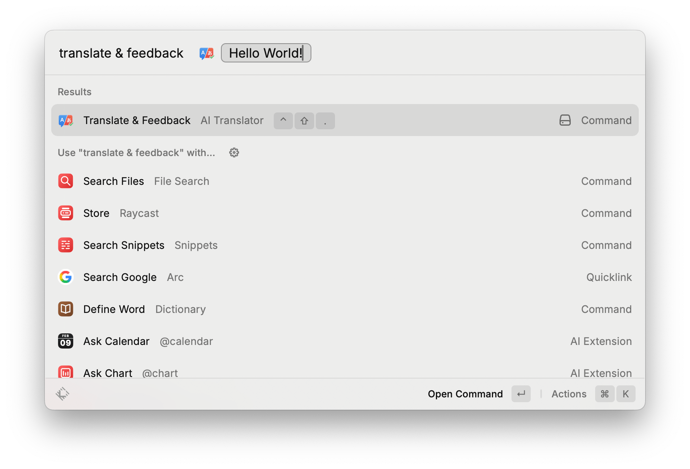

# AI Translator

Translate English to natural Japanese and get concise English feedback on grammar, nuance, and word choice. This Raycast extension uses Structured Outputs to return a translation, a quality score, and detected tone in a consistent format.

## Features
- English to Japanese translation tuned for natural phrasing
- Concise English feedback on grammar, nuance, and word choice
- Confidence score from 0 to 100
- Tone detection (for example: Casual, Formal)
- Auto-copies the translation to your clipboard on success
- Quick copy actions for translation and feedback

## Requirements
- Raycast installed
- OpenAI API key

## Installation
1. Clone this repo.
2. Install dependencies:

```sh
npm install
```

3. Start the extension in Raycast:

```sh
npm run dev
```

## Usage
1. Open Raycast.
2. Run the command: "Translate & Feedback".
3. Enter English text.

|  |  |
|:--:|:--:|
| Translate & Feedback command | Translation detail view |

The detail view shows:
- Japanese translation
- Original input (quoted)
- Feedback in English
- Score and detected tone in metadata

The translation is copied to the clipboard automatically. You can also copy the translation or feedback using the action panel shortcuts.

## Preferences
Set these in the Raycast extension preferences:
- OpenAI API Key (required)
- Model (optional, default: `gpt-4o-mini`)
  - `gpt-4o-mini` for speed
  - `gpt-4o-2024-08-06` for higher quality

## Project Structure
- `src/index.tsx` - Raycast command UI and OpenAI call

## Scripts
- `npm run dev` - Run the extension locally
- `npm run build` - Build the extension
- `npm run lint` - Lint the codebase
- `npm run fix-lint` - Auto-fix lint issues
- `npm run publish` - Publish to the Raycast Store

## License
MIT
